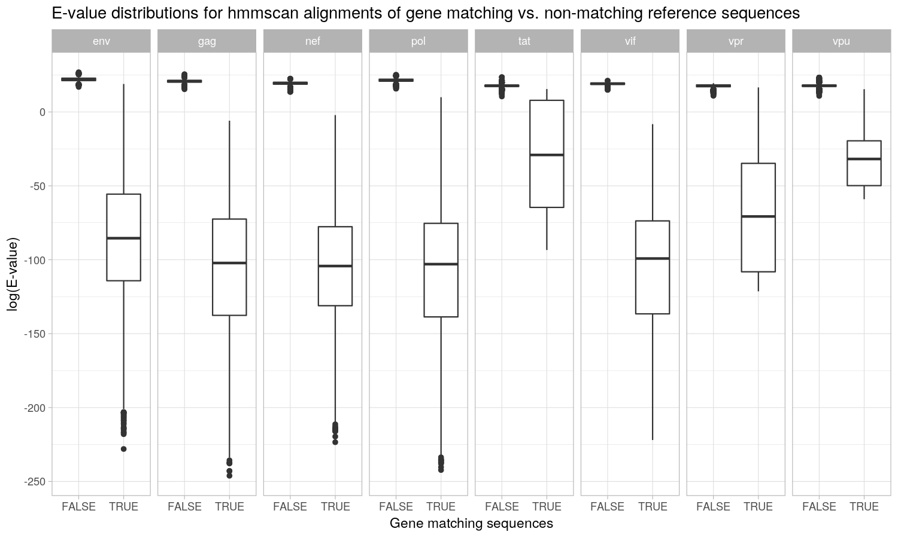
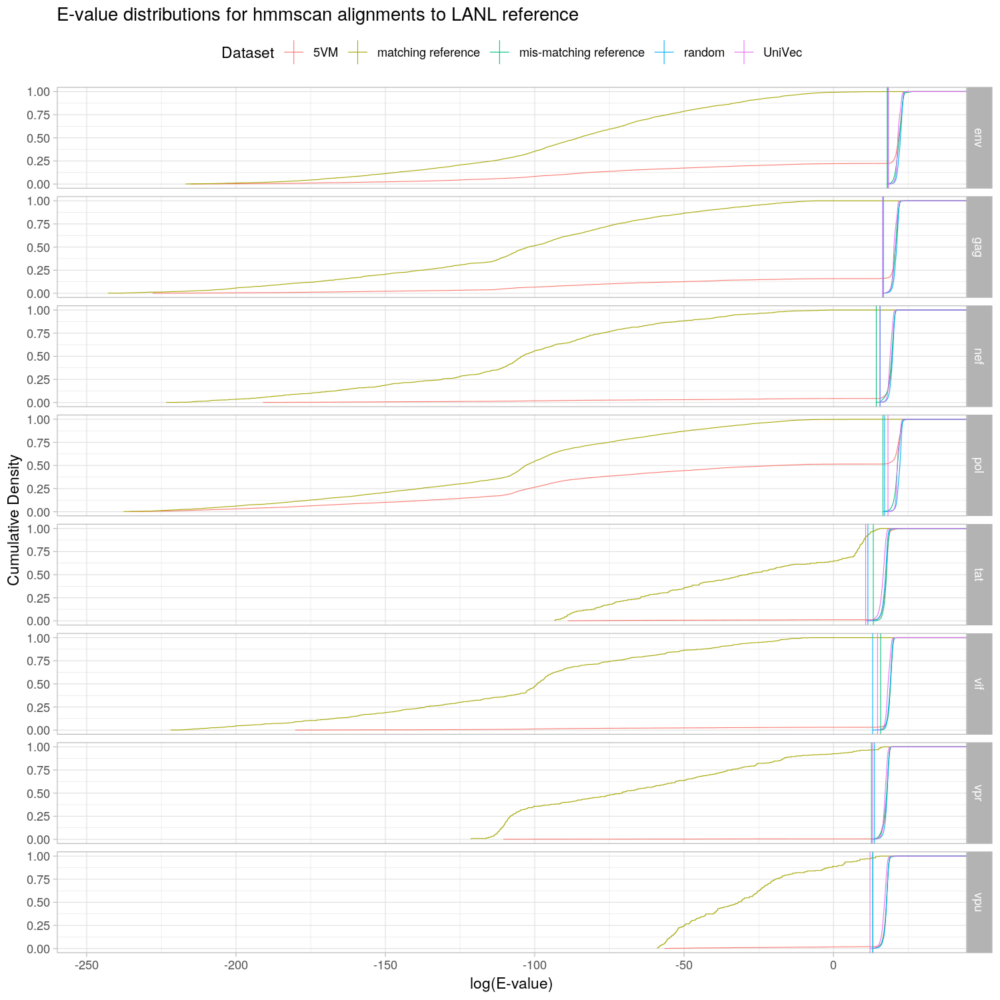
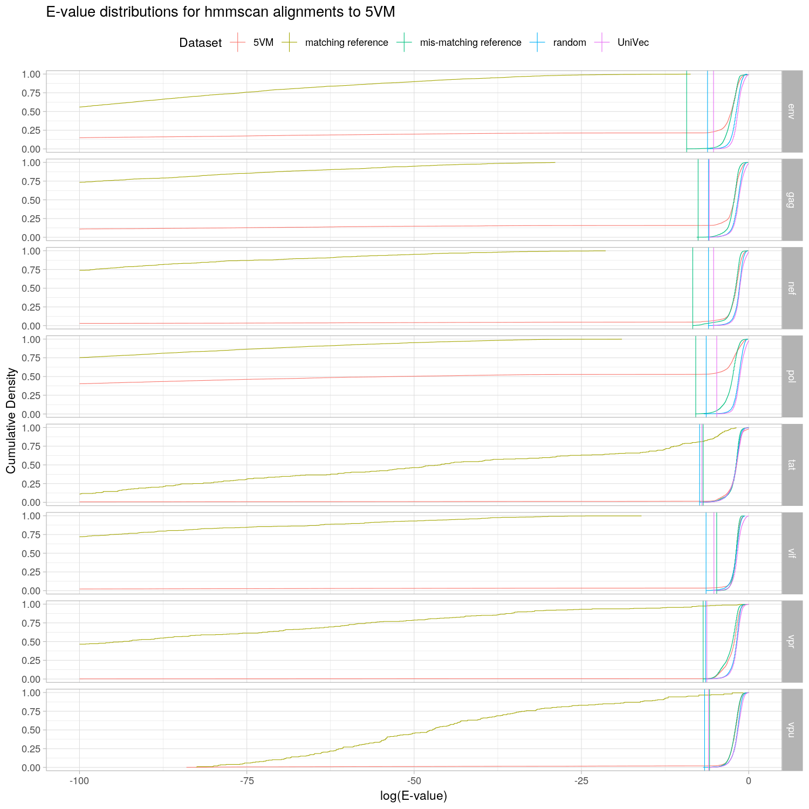

# Validation for alignment score thresholding

## Reproducibility

The required python packages can be installed with Anaconda Python using:

    conda create -n hivmmer-validation -c kantorlab hivmmer=0.1.3 sra-tools=2.9.1.1 scons=3.1.1 r-ggplot2 r-tidyverse
    conda activate hivmmer-validation

Next, replace hivmmer 0.1.3 with the current version on this branch, with:

    pip install -e ..

Run the threshold analyses with `scons`.

## Motivation

hivmmer aligns HIV sequences from next-generation sequencing (NGS) data to
a database of HIV reference sequencess from the
[Los Alamos HIV Sequence Database](http//www.hiv.lanl.gov)
using the probabilistic aligner [HMMER](http://hmmer.org). Incorrectly aligned
sequences can confound downstream analyses.

An NGS data set may contain non-HIV sequences (such as contaminants) that should
not be aligned. Also, when sequencing near full length HIV genomes, the HIV sequences
will originate from different HIV genes. Because hivmmer aligns the sequences
in amino acid space one gene at a time, sequences from one gene might
contaminate the alignment of a different gene.

An alignment score threshold can help discriminate between HIV sequences that
belong to a given HIV genes and those sequences that are non-HIV contaminants
or HIV sequences from a different gene.

## Estimation Strategy

To empirically determine the values of robust thresholds for each HIV gene, we construct
a series of data sets under different assumptions, then align them against the LANL
reference and observe the distribution of scores.

HMMER provides both a raw "bit" score and a E-value (or "expectation" value).
The bit score measures the likelihood of the alignment compared to the
likelihood of a null hypothesis (based on a random sequence model), and the
E-value measures the number of alignments expected to achieve that bit score by
change given the size of the reference database. Here, we focus on the E-values
returned by an hmmscan alignment, in which the LANL reference sequences are treated
as the reference database.

## Data sets

**5VM**: the [5 Virus Mix](https://github.com/cbg-ethz/5-virus-mix), an NGS data set
of 5 near full length HIV plasmid sequences mixed in equal proportions.

**[UniVec](https://www.ncbi.nlm.nih.gov/tools/vecscreen/univec/)**: a curated data set
from NCBI that contains representative sequences of common laboratory contaminants.

**random**: a synthetic data set with the same structure (number and length of sequences)
as **5VM**, but in which the individual nucleotides in the sequences have been randomly sampled.

**reference**: a synthetic data set with the same structure (number and length of sequences)
as **5VM**, but in which the sequences have been randomly sampled from the LANL reference
sequences.

Within each HIV gene alignment, we can define two additional data sets:

**matching reference**: the subset of sequences from **reference** that were
derived from that same gene.

**mis-matching reference**: the subset of sequences from **reference** that were
derived from a different gene.

Our assumptions are that:
1. The distribution of E-values for **matching reference** represents correct
   alignments.
2. The distributions of E-values for **mis-matching references**, **random**, and
   **UniVec** represent incorrect alignments.
3. The distirbution of E-values for **5VM** will be a mixture of the "correct"
   and "incorrect" distributions, which we can separate using an appropriate
   threshold.

## Matching vs. mis-matching reference sequences

As an initial test of this approach, we first compare the "correct" and "incorrect"
distributions for each gene within the **reference** data set:

For several of the genes (gag, nef, pol, vif), the distributions are completely
disjoint, and can be separated by an appropriate E-value threshold. For the
remaining genes, there is some overlap at larger E-values, but a threshold can
still be found that separates the majority of the correct distribution from the
incorrect distribution.

## Comparison of all the distributions

Next, we plot the cumulative density functions for each of the data sets in
each of the genes:

As expected, the **matching reference** sequences quickly accumulate at very low
E-values. Likewise, a portion of the **5VM** sequences also accumulate,
representing the sequences that came from that gene. In contrast, the smallest
E-values for each of the "incorrect" distributions (e.g. the vertical bars)
occur at a relatively high E-value.  Using that value as a threshold would
remove only 0% to 20% (depending on the gene) of the correct matching reference
sequences, while retaining no incorrect sequences. The three most important
genes for downstream analysis (gag, pol, env) would have close to 100% of the
correct sequences retained after applying these thresholds.

## Final Threshold Estimates

For each gene, we use the minimum of the lowest observed E-value across the
"incorrect" distributions (mis-matched reference, random and UniVec) as the
final threshold for implementation in hivmmer:

| gene | E-value threshold |
| ---- | ----------------- |
| env  | 0.00148 |
| gag  | 0.00180 |
| nef  | 0.00065 |
| pol  | 0.000464 |
| tat  | 0.000245 |
| vif  | 0.000543 |
| vpr  | 0.000935 |
| vpu  | 0.00110 |

## Future Work: Two-Stage Alignment

It may be beneficial to use a second round of alignment against a rebuilt
reference database for each gene using the sequences that are below these
thresholds in the first round of alignment. Here, we plot the resulting
E-values of this approach for the 5VM data set:

Again, the thresholding approach separates the correct matching reference
sequence from the incorrect sequences, with close to 100% of the correct gag,
pol, and env retained. However, these thresholds are now dependent on the
reference database for this specific data set, 5VM, and implementing this
approach in hivmmer would require recalibrating these thresholds for each new
input data set.
